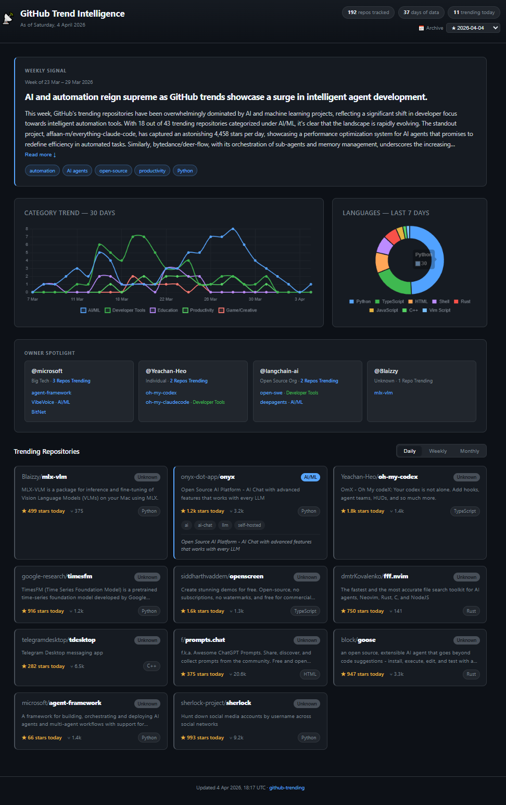

# GitHub Insights

[View on GitHub Pages](https://matthewww.github.io/github-trending/)

The amount of software being generated by the world is dramatically increasing.
More and more people are being empowered to bring life to their ideas with the assistance of AI tooling.

The objective of this repo is to visualise this massive software expansion. 
To show connections, trends, correlations and key contributors in digestible and visually engaging way.

## What it does
- This is changing over time as I figure out what can work.
- Generates a written digest, semantic similarity chart and other insights every week.

## Current Stack

- **Pipeline:** Python 3.11, GitHub Actions
- **Database:** Supabase (Postgres 17 + pgvector)
- **LLM:** Groq API (`openai/gpt-oss-120b`) — chat; `sentence-transformers/all-MiniLM-L6-v2` (local) — embeddings
- **Dashboard:** Vanilla JS SPA, Chart.js, GitHub Pages — no build step

----

